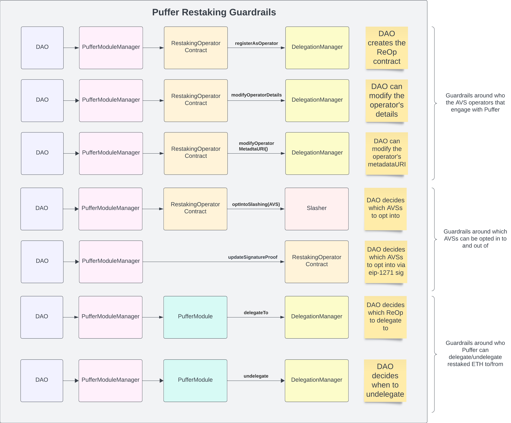

# PufferModuleManager

The `PufferModuleManager` contract serves as a factory and manager contract to facilitate restaking.

## Factory 
`PufferModuleManager` is a factory contract for creating protocol-owned [`PufferModule`](./PufferModule.md) and [`RestakingOperator`](./RestakingOperator.md) contracts.

It uses the UUPS upgrade pattern to allow for future upgrades to the contract.
Both `PufferModule` and `RestakingOperator` contracts use a [beacon proxy](https://www.cyfrin.io/blog/upgradeable-proxy-smart-contract-pattern#what-is-the-beacon-proxy-pattern) pattern to allow for future upgrades.

## Manager
`PufferModuleManager` serves as a central contract for coordinating calls to the `PufferModule` and `RestakingOperator` contracts.

Importantly, the `PufferModuleManager` is the only contract with access to call `RestakingOperator` functions and can solely call the EigenLayer-related functions on the `PufferModule` contracts. This restriction is in place to allow the DAO to control restaking operations to mitigate AVS and operator risk.