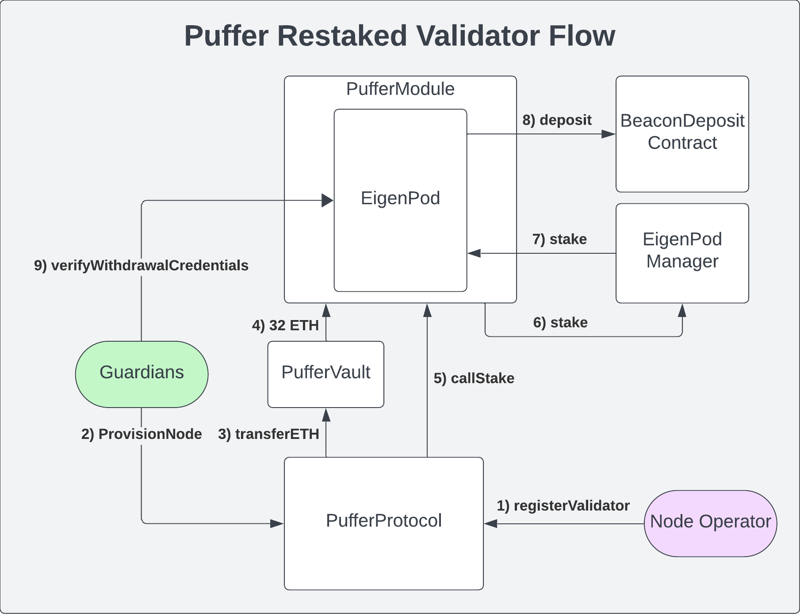

# PufferProtocol

The `PufferProtocol` is the contract central to managing validator operations, including accounting and the custody of validator bonds and [VTs](./ValidatorTicket.md).

## Overview


## Registering a new validator
To register a new validator, the Node operator has a few options:
- Pay the bond and purchase Validator Tickets in ETH
- Pay either the bond or the Validator Tickets in ETH and have the other transferred from the Node Operator's EOA
- Have both the bond and Validator Tickets transferred from the Node Operator's EOA


No matter what option is chosen, the Node Operator will call the `registerValidator` function on the `PufferProtocol` contract.

```javascript
function registerValidatorKey(
    ValidatorKeyData calldata data,
    bytes32 moduleName,
    Permit calldata pufETHPermit,
    Permit calldata vtPermit
)
```

#### `ValidatorKeyData` struct

- **`bytes blsPubKey`**: This is [BLS public key](https://ethereum.org/en/developers/docs/consensus-mechanisms/pos/keys/) for the validator that the Node Operator has generated. 

- **`bytes signature`**: This is the signature of the deposit data by the validator's BLS private key.

- **`bytes32 depositDataRoot`**: This is the root hash of the deposit data.

- **`bytes[] blsEncryptedPrivKeyShares`**: This is an array of encrypted private key shares - [one share for each Guardian](https://docs.puffer.fi/protocol/guardians#what-are-their-duties).

- **`bytes blsPubKeySet`**: This is the concatenated list of sharded public keys

- **`bytes raveEvidence`**: If the Node Operator is using an Enclave, they must provide a valid RAVE evidence. The guardians will check if the RAVE is valid, and if it is not, the validator will be skipped.

#### `moduleName`

This is the name of the `PufferModule` that the validator is registering for. The `PufferModule` must be registered with the `PufferProtocol` contract (created via the [`PufferModuleManager`](./PufferModuleManager.md) factory).

#### `pufETHPermit`

This is the Permit data for the `pufETH` token. If the Node Operator is purchasing their bond with ETH, they can submit an empty Permit struct.
If the Node Operator is transferring their pufETH as the bond, they must provide a valid Permit struct or call `pufETH.approve(pufferProtocol, amount)` before the registration.

#### vtPermit

This is the Permit data for the `ValidatorTicket` token. If the Node Operator is paying for VT's with ETH, they can submit an empty Permit struct.

If the Node Operator is transferring their VTs, they must provide a valid Permit struct or call `validatorTicket.approve(pufferProtocol, amount)` before the registration.

To minimize the time that protocol's ETH is in the beacon chain entry and exit queues, a `minimumVtAmount = 28 VTs` is required upon registration.

#### Registration side effects

Upon successful registration, the Node Operator's validator will be added to the module's queue for provisioning. The Guardians will each check that the registration data is valid and that their enclave received keyshare custody. If if everything is correct, the Guardians will provision the validator with 32 ETH from the `PufferVault` to deploy their validator to the `PufferModule's` `EigenPod`.

Being part of a `PufferModule` means the validator's beacon chain ETH will be restaked and delegated to a `RestakingOperator` decided by the DAO.


## Provisioning a validator

Once a quorum of Guardians produce a valid signature, the  `provisionNode` function is called to provision the validator with 32 ETH.

The validator will be provisioned if:
- The registration data is valid, e.g., correct withdrawal credentials and valid deposit message and signature
- There is enough liquidity for provisioning (≥ 32 ETH)
- The BLS public key is not already in use/was not used before
- The RAVE evidence is valid (if registering an enclave validator)
- The `PufferModule` is not at capacity

If the guardians need to skip the validator to service the next queue, they can call the `skipProvisioning` function on the PufferProtocol. This dequeues the validator's registration, returns their bond, and burns `vtPenalty` VTs to prevent griefing. 

`provisionNode` is one of the most important functions in the `PufferProtocol` contract with important side effects. In the same atomic transaction:
- It transfers 32 ETH from the `PufferVault -> PufferModule -> EigenPod -> BeaconChain Deposit contract`
- It increments the `_numberOfActivePufferValidators` on [`PufferOracleV2`](./PufferOracleV2.md) contract

By performing these steps in the same atomic transaction, we ensure the `PufferVault's` exchange rate remains unchanged.

Importantly, the `PufferVault` calculates the exchange rate based on the *totalAssets* that the vault owns, and takes into the account the `PUFFER_ORACLE.getLockedEthAmount()`. 

Because 32 ETH is leaving the Vault, we must increment the `PUFFER_ORACLE.getLockedEthAmount()` by 32 ETH so that the exchange rate remains unchanged. See [`here`](./PufferOracleV2.md) for more details.

## Exiting a validator
Exiting a validator requires broadcasting a signed voluntary exit message on the beacon chain. 

#### Node Operators
Node Operators can exit at any time, but their VT balance will be penalized if they exit before `minimumVtAmount` days have elapsed.

#### Guardians
Guardians can use their enclaves to sign voluntary exit messages and will eject validators if:
- their validator balance falls below the `_ejectionThreshold` ETH set in the [`GuardianModule`](./GuardianModule.md).
- the Node Operator did not replenish VTs after their locked amount expired

#### After exiting 
After the validator is exited from the beacon chain, its full withdrawal ETH will appear in the `PufferModule's` `EigenPod`. The `PufferModuleManager` facilitates the EigenLayer full withdrawal process, which results in the ETH being transferred to the `PufferModule`. 

The Guardians can then call `batchHandleWithdrawals` to return Node Operator bonds, burn VTs, and [do accounting](./PufferOracleV2.md). This process must handle three scenarios:

Note: In all scenarios the `_numberOfActivePufferValidators` will be decremented on the `PufferOracleV2` contract decreasing the locked ETH amount by 32 ETH. 

1. <span style="color:green"> withdrawalAmount ≥ 32 ETH</span>

32 ETH is transferred to the PufferVault and `withdrawalAmount - 32 ETH` remains in the `PufferModule` to be collected as rewards by the Node Operator. The Node Operator receives their full bond amount back.

2. <span style="color:orange">withdrawalAmount < 32 ETH</span>

`withdrawalAmount` ETH is transferred to the PufferVault and `32 ETH - withdrawalAmount` is burned from the Node Operator's bond. It is assumed that the Guardians will eject the validator far before inactivity penalties lead to `32 ETH - withdrawalAmount > bond`. The Node Operator receives part of their bond back.

3. <span style="color:red">Validator was slashed</span>

`withdrawalAmount` is transferred to the `PufferVault` and the **entire** bond will be burned regardless of the slashing amount. If there is a major slashing incident, the losses will be socialized across all pufETH holders.

## Depositing Validator Tickets (VT)

A Node Operator may have multiple validators running, with each consuming 1 VT per day. `getValidatorTicketsBalance() returns(uint256)` returns the amount of VTs deposited by the Node Operator rather than the real-time VT balances due to the exhorbitant gas costs that it would require to constantly report.

Instead, the Guardians are tracking VT consumption off-chain and Node Operators can visualize this via frontends. Periodically, the Node Operators will need to top up their VT balance to avoid being ejected which is accomplished by calling `depositValidatorTickets(permit, nodeOperator)`. 

## Validator Tickets withdrawal
Since VT consumption is tracked off-chain, withdrawing excess VTs, `withdrawValidatorTickets` can only be called when the Node Operator has no active or pending validators. In the future, VT withdrawals can be accomplished via ZKPs.

## Validator Rewards

In Puffer, Node Operators earn 100% of the consensus and execution rewards their validators generate because they already purchased VTs. 

If using software like MEV-Boost, the execution rewards are easily directed to the Node Operator's wallet address as the `fee recipient` value.

Consensus rewards are always sent to validators' withdrawal credentials, which point to `EigenPods`. Once EigenLayer upgrades their partial withdrawal process, consensus rewards will be claimable from the [PufferModules](./PufferModule.md#consensus-rewards). 

Puffer validators will also earn a percentage of the protocol's [restaking rewards](./PufferModule.md#restaking-rewards) which will also be claimable in future EigenLayer upgrades. 