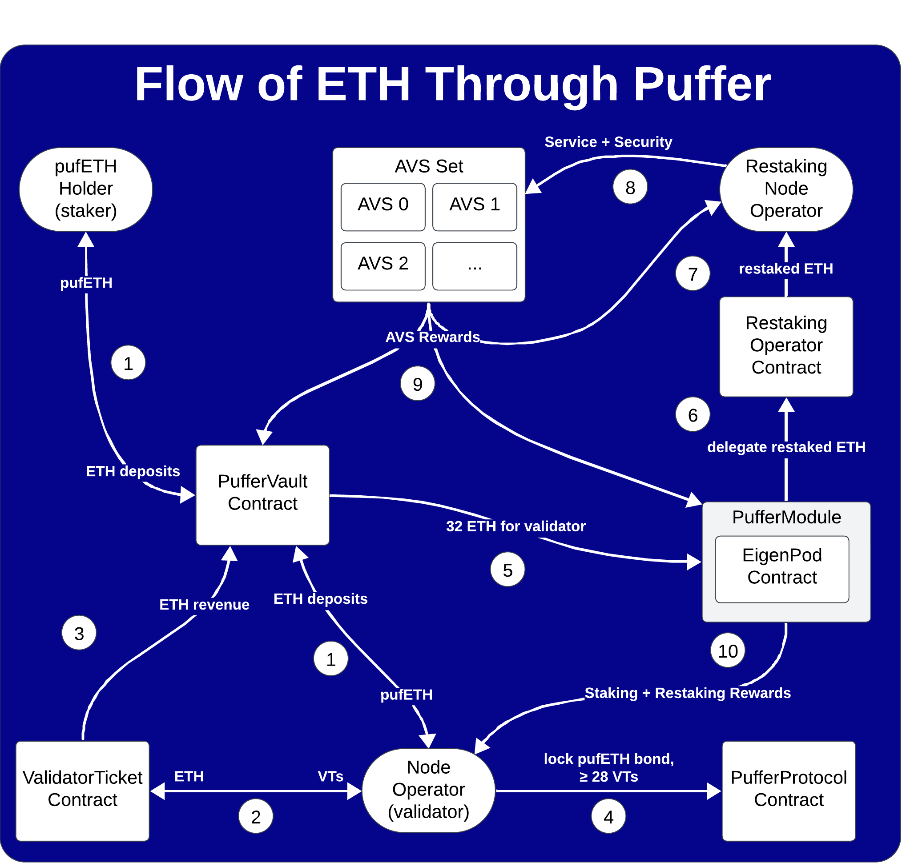

# Puffer Protocol
## System Overview
The Puffer protocol integrates a generic ERC4626 vault with specialized native restaking logic, ensuring a robust framework for Ethereum staking and EigenLayer restaking. Upon depositing ETH into the vault, users receive an LRT ([pufETH](https://etherscan.io/address/0xd9a442856c234a39a81a089c06451ebaa4306a72)), which accrues rewards over time through the sale of [Validator Tickets](./ValidatorTicket.md) and revenue from running EigenLayer AVSs. 

This implementation is designed to foster decentralization by incorporating several safeguards that support permissionless validators, thereby keeping the system both open and secure.

### Contracts
- [`PufferProtocol`](./PufferProtocol.md): Serves as the core contract for managing the validator lifecycle and ETH routing between the PufferVault and EigenLayer.
- [`PufferVault`](https://github.com/PufferFinance/pufETH/tree/main/docs): Handles ETH deposits, withdrawals, and rewards accumulation via the pufETH LRT.
- [`GuardianModule`](./GuardianModule.md): Manages the Guardians, ensuring they operate within their roles, especially in validator provisioning, skipping, and ejecting validators.
- [`EnclaveVerifier`](./EnclaveVerifier.md): Verifies that the Guardians are operating with valid Intel SGX enclaves, thus ensuring the security of key operations.
- [`PufferOracleV2`](./PufferOracleV2.md): Provides data for the PufferVault and ValidatorTicket contracts, particularly for calculating the pufETH conversion rate, enforcing the burst threshold, and pricing Validator Tickets.
- [`PufferModuleManager`](./PufferModuleManager.md): Facilitates the creation and management of PufferModule and RestakingOperator contracts, which are critical for the resktaing operations.
- [`PufferModule`](./PufferModule.md): Acts as a container for an EigenPod which hosts multiple validators, responsible for validator rewards and restaking delegations.
- [`RestakingOperator`](./RestakingOperator.md): A DAO-controllable EigenLayer operator that receives delegations from PufferModules.
- [`ValidatorTicket`](./ValidatorTicket.md): An ERC20 contract that mints tokens that are needed to run validators on Puffer. When they are minted the revenue pays pufETH holders a proxy for Ethereum PoS rewards.

# Protocol flows
## ETH Flow

1. Stakers and Node Operators (NoOps) deposit ETH into the PufferVault and receive pufETH, representing their stake and entitlement to future rewards.
2. ETH is paid to mint Validator Tickets (VTs), which are necessary for NoOps to register validators. 
3. The ETH from VTs is paid directly as rewards to pufETH holders, serving as a proxy for Ethereum Proof of Stake rewards.
4. NoOps lock a pufETH bond and a minimum amount of VTs (≥ 28) to register their validators with the PufferProtocol.
5. Upon successful registration, the PufferProtocol allocates 32 ETH from the PufferVault to fund a validator.
6. The PufferModule then delegates the restaked ETH to a RestakingOperator contract chosen by the Puffer DAO.
7. The restaked ETH is allocated a DAO-chosen Restaking Node Operator (RNO).
8. The RNO services various Actively Validated Services (AVSs), enhancing the security of their protocols while earning rewards for the Puffer protocol.
9. AVS rewards are distributed back to pufETH holders and RNOs, incentivizing participation in the protocol.
10. NoOps keep 100% of their generated staking rewards from running validators and earn a portion of the AVS rewards to increase profitability.

## Node Operators (NoOps)
### Preliminary Decisions
Before [registering](./PufferProtocol.md#1-prepare-bond-and-vts), a NoOp must make two imporant decisions:

1. **Validator Tickets ([VTs](./ValidatorTicket.md))**: Determine the quantity of VTs to purchase or transfer from their own wallet for the new validator. This amount must exceed the minimum VT requirement for registration of 28 days.
2. **Validator Setup**: Decide on the validator configuration. Using an SGX enclave requires a bond deposit of 1 ETH, while a NO-SGX setup requires 2 ETH. The former requires specific hardware while the latter is compatible with any existing validator setup.

### Registration Workflow
The registration process involves creating a validator key and depositing of the required bond and VTs. See the [PufferProtocol docs](./PufferProtocol.md) for more details. 

### Ongoing VT Maintenance
To keep the validator operational, NoOps must regularly top up their VTs. Each active validator consumes one VT per day, and failing to maintain an adequate VT balance will lead to the validator being ejected from the Beacon chain.

### Rewards
#### Consensus Rewards Claiming
All validators registered with a PufferModule have their consensus rewards directed to the module’s EigenPod. To facilitate the claiming process, Guardians transfer these rewards from the EigenPod to the PufferModule and then publish the rewards Merkle roots. However, NoOps cannot currently claim these rewards due to limitations in gas efficiency. An upcoming EigenLayer upgrade aims to improve this aspect, after which NoOps will be able to submit valid Merkle proofs to the PufferModule contract to claim their rewards. This upgrade is essential for enabling a more gas-efficient and streamlined rewards claiming process.

#### Execution Rewards
Execution rewards, e.g., from MEV-Boost, are directly paid to the NoOp's specified wallet as the `fee recipient`. This setup ensures that NoOp has full MEV-autonomy and receive liquid rewards immediately upon proposing a block.

#### Restaking Rewards
NoOps are elligible to earn restaking rewards due to Puffer's integration with EigenLayer. These rewards will accumulated within PufferModules and become claimble by NoOps as EigenLayer introduces their payment features.

### Exiting the Validator
To exit, a NoOp simply broadcasts a voluntary exit message to the Beacon Chain. Subsequently, the Guardians manage the full withdrawal process. If the validator did not incur losses, the bond is returned to the NoOp. Remaining VTs can only be withdrawn if the NoOp has no active or pending validators. This ensures a clean and straightforward exit from the system.

## Restaking Node Operators (RNOs)
Restaking Node Operators (RNOs) are permissioned operators selected based on their technical reliability and reputation. They play a crucial role in operating Actively Validated Services (AVSs) on behalf of the Puffer protocol. 
### Setup
RNOs must first register their operator keys. This involves generating two types of keys:
- ECDSA Key: Used for standard Ethereum transactions and interactions within the protocol.
- BLS Key: Required for signing off on tasks for AVSs

Next, the RNO must register the key with the Puffer DAO who will assign the RNO to a [`RestakingOperator`](./RestakingOperator.md) contract (ReOp). This contract serves as the operational interface for the RNO, allowing the DAO to oversee and manage the AVSs each RNO is responsible for.

### Service
RNOs are expected to maintain exemplary operational standards, including high security, maximal uptime, and robust performance. Their responsibilities include:

- **Ensuring AVS Uptime**: Maintaining continuous operation of AVSs to avoid penalties and maximize performance.
- **Security Oversight**: Implementing stringent security measures to protect the network and its staked assets from threats.

As EigenLayer evolves to include mechanisms like slashing, RNOs are required to be compliant and safeguard their operations against.

### Rewards
The compensation for RNOs involves a percentage of the rewards from AVSs, as determined by the DAO. Currently, the EigenLayer protocol does not support direct payments; however, provisions for these payments will be integrated into the Puffer protocol in future updates.

## Guardians
### Setup
Guardians are selected from among the most reputable members and organizations within the Ethereum community. Each Guardian is required to operate an Intel SGX machine. This setup provides a robust defense-in-depth strategy, crucial for securely managing sensitive protocol operations.

### Registering Keys
Upon becoming a Guardian, each member registers an Externally Owned Account (EOA) key for signing various protocol functions. Additionally, Guardians generate an Ethereum key within their SGX enclave and commit the public key during the remote attestation process. This attestation proves to the GuardianModule that they are operating the approved enclave, enhancing security and trust in their actions.

### Enclave Constraints
The GuardianModule restricts the actions that can be taken with enclave keys. Specifically, it allows the enclave to produce a signature for validator registration only if the registration is valid (e.g., the deposit signature checks out) and the enclave successfully decrypts a validator's BLS key share. Besides this, the enclave can decrypt the key share solely to sign a voluntary exit message. Importantly, it cannot decrypt the key share for any other type of signature, such as signing a slashable message.

### Provisioning Validators
Guardians provision queued validators with 32 ETH from the PufferVault, assuming sufficient liquidity. This process involves verifying each registration through the Guardian's enclave as previously described. Any registrations found invalid are skipped, refunding the operators' bonds but penalizing their VTs to disincentivize protocol griefing.

### Ejecting Validators
Guardians also have the responsibility to eject validators under certain circumstances, such as a drop in the validator's balance below a set threshold or failure to maintain sufficient VTs. This action helps maintain the health and security of the network.

### Handling Withdrawals
After a validator exits, the process of managing the withdrawal of their staked ETH involves several critical steps facilitated by the Guardians.

#### Withdrawal Process
Once a validator has exited, their ETH is redirected to the PufferModule's EigenPod. The EigenLayer withdrawal process, overseen by the guardians, utilizes Merkle proofs and a queuing system to ensure the ETH is accurately transferred back to the PufferModule.

#### Execution of Withdrawals
The Guardians then invoke the `batchHandleWithdrawals()` function on the [PufferProtocol](./PufferProtocol.md#exiting-a-validator). This function is responsible for returning pufETH bonds to NoOps adjusted for penalties and burning any VTs that have been consumed during the validator's operation. This process is essential for protocol accounting.

### Enforcing Burst Threshold
The burst threshold is a critical safety mechanism designed to prevent the Puffer protocol from exceeding 22% of the total Ethereum validator set, safeguarding the network against centralization risks. Guardians monitor and report the total number of active validators on the Beacon Chain to ensure the protocol remains below this threshold.

## System components:

### [PufferProtocol](./PufferProtocol.md)

| File | Type | Upgradeable | Inherited | Deployed |
| -------- | -------- | -------- | -------- | -------- |
| [`IPufferProtocol.sol`](../src/interface/IPufferProtocol.sol) | Interface | / | YES | / |
| [`PufferProtocolStorage.sol`](../src/PufferProtocolStorage.sol) | Singleton | UUPS Proxy | YES | / |
| [`PufferProtocol.sol`](../src/PufferProtocol.sol) | Singleton | UUPS Proxy | NO | / |

### [GuardianModule](./GuardianModule.md)

| File | Type | Upgradeable | Inherited | Deployed |
| -------- | -------- | -------- | -------- | -------- |
| [`IGuardianModule.sol`](../src/interface/IGuardianModule.sol) | Interface | / | YES | / |
| [`IEnclaveVerifier.sol`](../src/interface/IEnclaveVerifier.sol) | Interface | / | YES |/ |
| [`EnclaveVerifier.sol`](../src/EnclaveVerifier.sol) | Singleton | NO | YES | / |
| [`GuardianModule.sol`](../src/GuardianModule.sol) | Singleton | NO | NO | / |

### [ValidatorTicket](./ValidatorTicket.md)

| File | Type | Upgradeable | Inherited | Deployed |
| -------- | -------- | -------- | -------- | -------- |
| [`IValidatorTicket.sol`](../src/interface/IValidatorTicket.sol) | Interface | / | YES | / |
| [`ValidatorTicket.sol`](../src/ValidatorTicket.sol) | Singleton | UUPS Proxy | NO | / |

### [PufferOracleV2](./PufferOracleV2.md)

| File | Type | Upgradeable | Inherited | Deployed |
| -------- | -------- | -------- | -------- | -------- |
| [`IPufferOracleV2.sol`](../lib/pufETH/src/interface/IPufferOracleV2.sol) | Interface | / | YES | / |
| [`PufferOracleV2.sol`](../src/PufferOracleV2.sol) | Singleton | / | NO | / |

### [PufferModuleManager](./PufferModuleManager.md)

| File | Type | Upgradeable | Inherited | Deployed |
| -------- | -------- | -------- | -------- | -------- |
| [`IPufferModuleManager.sol`](../src/interface/IPufferModuleManager.sol) | Interface | / | YES | / |
| [`PufferModuleManager.sol`](../src/PufferModuleManager.sol) | Singleton | UUPS Proxy | NO | / |

### [PufferModules](./PufferModule.md)

| File | Type | Upgradeable | Inherited | Deployed |
| -------- | -------- | -------- | -------- | -------- |
| [`IPufferModule.sol`](../src/interface/IRestakingOperator.sol) | Interface | / | YES | / |
| [`PufferModule.sol`](../src/PufferModule.sol) | [Beacon Proxy](https://docs.openzeppelin.com/contracts/5.x/api/proxy#BeaconProxy) | YES | NO | / |

### [RestakingOperators](./RestakingOperator.md)

| File | Type | Upgradeable | Inherited | Deployed |
| -------- | -------- | -------- | -------- | -------- |
| [`IPufferModule.sol`](../src/interface/IPufferModule.sol) | Interface | / | YES | / |
| [`PufferModule.sol`](../src/RestakingOperator.sol) | [Beacon Proxy](https://docs.openzeppelin.com/contracts/5.x/api/proxy#BeaconProxy) | YES | NO | / |

## Dependencies

All of our smart contract inherit from **AccessManaged | AccessManagedUpgradeable**

- [Openzeppelin smart contracts](https://github.com/OpenZeppelin/openzeppelin-contracts)
    - AccessManager
    - AccessManaged
    - ERC20
    - ERC20Permit
    - ERC1967Proxy
    - UpgradeableBeacon
    - ECDSA
    - MerkleProof
    - MessageHashUtils
    - Strings
    - Address
    - SafeCast
- [Openzeppelin upgradeable smart contracts](https://github.com/OpenZeppelin/openzeppelin-contracts-upgradeable)
    - AccessManagedUpgradeable
    - UUPSUpgradeable
    - Initializable
- [EigenLayer](https://github.com/Layr-Labs/eigenlayer-contracts)

