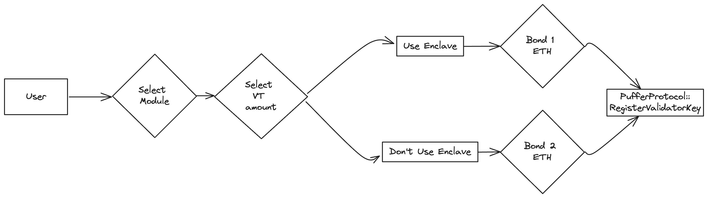

# Puffer Protocol

## System Overview
<!--  -->

## User flows

### Validator registration

Before registration, the Node operator needs to make a few desecions:
1. The amount of Validator Tickets that he wants to purchase / transfer from own wallet for the new validator. This amount must be bigger than the minimum VT amount required for validator registration.
2. The PufferModule in which he will participate. PufferModules will participate in various Restaking services and may earn different rewards. The user can't change PufferModule at a later point in time. In order to do that, he would need to exit the Validator completely and then go through the registration flow to another PufferModule.
3. The Validator setup. If the Node operatod decides to use SGX, the bond that he needs to deposit is 1 ETH, for NO-SGX it is 2 ETH.

### Consensus rewards claiming for the Node Operators

All Validators registered to a PufferModule will have their rewards sent to PufferModule's EigenPod. The Guardians will transfer ETH from the EigenPod to the PufferModule and publish the rewards Merkle roots. In order to claim the rewards, the Node Operators need to submit a valid merkle proof to the PufferModule contract.

### Exiting the validator

The Node Operator broadcasts a voluntary exit message to the Beacon chain and that's it. The guardians will handle the full withdrawal, and if the Validator didn't incur any loss, the bond will be returned to the Node Operator. The Node Operator can withdraw the remaining Validator Tickets only if he has no active or pending validators.

## System components:

### [PufferProtocol](./PufferProtocol.md)

| File | Type | Upgradeable | Inherited | Deployed |
| -------- | -------- | -------- | -------- | -------- |
| [`IPufferProtocol.sol`](../src/interface/IPufferProtocol.sol) | Interface | / | YES | / |
| [`PufferProtocolStorage.sol`](../src/PufferProtocolStorage.sol) | Singleton | UUPS Proxy | YES | / |
| [`PufferProtocol.sol`](../src/PufferProtocol.sol) | Singleton | UUPS Proxy | NO | / |

### [GuardianModule](./GuardianModule.md)

| File | Type | Upgradeable | Inherited | Deployed |
| -------- | -------- | -------- | -------- | -------- |
| [`IGuardianModule.sol`](../src/interface/IGuardianModule.sol) | Interface | / | YES | / |
| [`IEnclaveVerifier.sol`](../src/interface/IEnclaveVerifier.sol) | Interface | / | YES |/ |
| [`EnclaveVerifier.sol`](../src/EnclaveVerifier.sol) | Singleton | NO | YES | / |
| [`GuardianModule.sol`](../src/GuardianModule.sol) | Singleton | NO | NO | / |

### [ValidatorTicket](./ValidatorTicket.md)

| File | Type | Upgradeable | Inherited | Deployed |
| -------- | -------- | -------- | -------- | -------- |
| [`IValidatorTicket.sol`](../src/interface/IValidatorTicket.sol) | Interface | / | YES | / |
| [`ValidatorTicket.sol`](../src/ValidatorTicket.sol) | Singleton | UUPS Proxy | NO | / |

### [PufferOracleV2](./PufferOracleV2.md)

| File | Type | Upgradeable | Inherited | Deployed |
| -------- | -------- | -------- | -------- | -------- |
| [`IPufferOracleV2.sol`](../lib/pufETH/src/interface/IPufferOracleV2.sol) | Interface | / | YES | / |
| [`PufferOracleV2.sol`](../src/PufferOracleV2.sol) | Singleton | / | NO | / |

### [PufferModuleManager](./PufferModuleManager.md)

| File | Type | Upgradeable | Inherited | Deployed |
| -------- | -------- | -------- | -------- | -------- |
| [`IPufferModuleManager.sol`](../src/interface/IPufferModuleManager.sol) | Interface | / | YES | / |
| [`PufferModuleManager.sol`](../src/PufferModuleManager.sol) | Singleton | UUPS Proxy | NO | / |

### [PufferModules](./PufferModule.md)

| File | Type | Upgradeable | Inherited | Deployed |
| -------- | -------- | -------- | -------- | -------- |
| [`IPufferModule.sol`](../src/interface/IRestakingOperator.sol) | Interface | / | YES | / |
| [`PufferModule.sol`](../src/PufferModule.sol) | [Beacon Proxy](https://docs.openzeppelin.com/contracts/5.x/api/proxy#BeaconProxy) | YES | NO | / |

### [RestakingOperators](./RestakingOperator.md)

| File | Type | Upgradeable | Inherited | Deployed |
| -------- | -------- | -------- | -------- | -------- |
| [`IPufferModule.sol`](../src/interface/IPufferModule.sol) | Interface | / | YES | / |
| [`PufferModule.sol`](../src/RestakingOperator.sol) | [Beacon Proxy](https://docs.openzeppelin.com/contracts/5.x/api/proxy#BeaconProxy) | YES | NO | / |

## Dependencies

All of our smart contract inherit from **AccessManaged | AccessManagedUpgradeable**

- [Openzeppelin smart contracts](https://github.com/OpenZeppelin/openzeppelin-contracts)
    - AccessManager
    - AccessManaged
    - ERC20
    - ERC20Permit
    - ERC1967Proxy
    - UpgradeableBeacon
    - ECDSA
    - MerkleProof
    - MessageHashUtils
    - Strings
    - Address
    - SafeCast
- [Openzeppelin upgradeable smart contracts](https://github.com/OpenZeppelin/openzeppelin-contracts-upgradeable)
    - AccessManagedUpgradeable
    - UUPSUpgradeable
    - Initializable
- [EigenLayer](https://github.com/Layr-Labs/eigenlayer-contracts)

