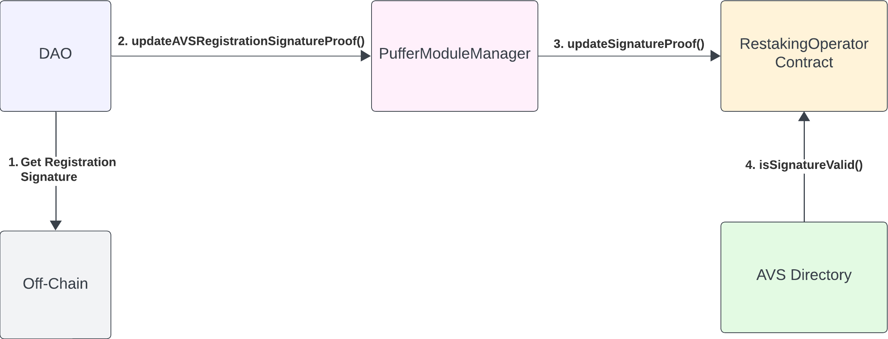

# Restaking Operator

EigenLayer allows for EOAs and smart contracts to be AVS operators in their system. The Puffer protocol opts for the latter by introducing `RestakingOperator` contracts to handle EigenLayer interactions. This reduces the trust placed in the operators, as the `RestakingOperator` contract controls AVSs selections.

Upon contract initialization, the `RestakingOperator` contract registers as an operator with EigenLayer's [DelegationManager](https://github.com/Layr-Labs/eigenlayer-contracts/blob/dev/src/contracts/core/DelegationManager.sol), allowing [`PufferModule`](./PufferModule.md) contracts to delegate to it.

All `RestakingOperator` contract functions are restricted to the  [PufferModuleManager](./PufferModuleManager.md) contract, giving the DAO control over which AVSs the operator can partake in. 

## EIP-1271 and EigenLayer

EigenLayer uses EIP-1271 to allow contracts to "sign off" on AVS registrations. The flow for a `RestakingOperator` contract to opt in to an AVS is as follows:
1. DAO selects the EOA of the operator, decides the message to be signed (e.g., opt into an AVS), and computes the digest
2. DAO calls `PufferModuleManager` to forward the call to `RestakingOperator`
3. `PufferModuleManager` calls `updateSignatureProof` to record the digest
4. [`AVSDirectory`](https://github.com/Layr-Labs/eigenlayer-contracts/blob/dev/src/contracts/core/AVSDirectory.sol) calls `isValidSignature` to verify EIP-1271 signature.

## Important Functions
### `updateSignatureProof`
Sets a digest for EIP-1271 signature

### `isValidSignature`
Called by the `AVSDirectory` to verify an EIP-1271 signature